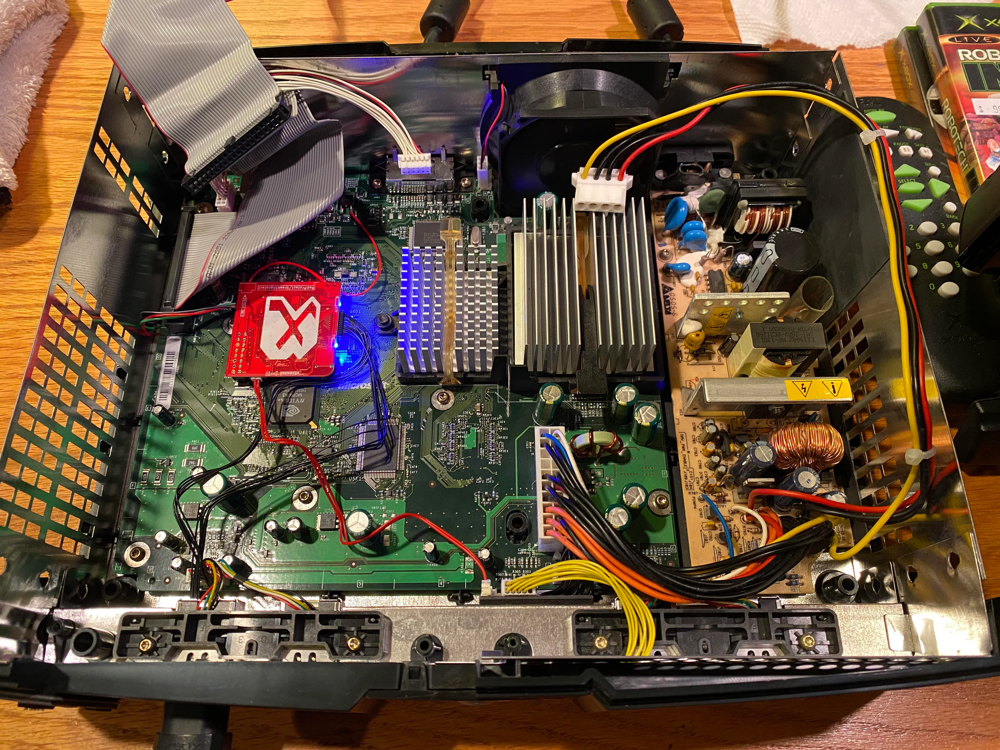

# Original Xbox Resources

Greetings Xbox Community!

Welcome to Original Xbox Resources,
Since release, the community surrounding the Original Xbox have achieved some amazing things, I wish to preserve information around the process, so everything is easily accessible to the community.
Your valuable contributions and feedback to enhance the accuracy and quality of the information provided are welcomed.

My aim is to create a resource that reflects the collective knowledge and insights of the vibrant Xbox community.

Please note that the information presented here is currently in draft form and may contain inaccuracies or require further refinement.

Feel free to create a pr or an <a href="https://github.com/S33G/og-xbox/issues/new">issue</a> in our repository. Whether you've spotted an error, have a suggestion for improvement, or want to share additional insights, your active participation is crucial.

Thank you for your dedication in shaping this content into a valuable resource for the entire Xbox community. Together, we can create something truly exceptional!

    

        Useful resources for the original Xbox. For educational use only.
        This is a work in progress. Pull requests are more than welcome!
        My intention here is to provide a mirror of useful things collected in a easily navigable / accessible place.
         
    

    

## Table of Contents

### Motherboards

- [1.1 Motherboard](board/1.1/README.md)
- [1.4 Motherboard](board/1.4/README.md)
- [1.6 Motherboard](board/1.6/README.md)

## Useful Repos
[Rocky5/Xbox-Softmodding-Tool](https://github.com/Rocky5/Xbox-Softmodding-Tool)

[Rocky5/XBMC4Gamers](https://github.com/Rocky5/XBMC4Gamers)

[Endgame exploit](https://github.com/XboxDev/endgame-exploit)

[JayFoxRox/xbox-fps-overlay](https://github.com/JayFoxRox/xbox-fps-overlay)

[LoveMHz/xbox-board-re](https://github.com/LoveMHz/xbox-board-re) (+ High res images + svg v1.6)

[Pinecone](https://github.com/Xbox-Preservation-Project/Pinecone)

[Team-Resurgent/Pandora](https://github.com/Team-Resurgent/Pandora)

[Xbox Hard Drive Compatibility Chart](https://xboxdrives.x-pec.com/?p=list)

[dx4m/Xbox-EEPROM-Utility](https://github.com/dx4m/Xbox-EEPROM-Utility)

[lowtolerance/OGXMUOTA](https://github.com/lowtolerance/OGXMUOTA)

[N64-Freak/Xbox-CPU-interposer](https://github.com/N64-Freak/Xbox-CPU-interposer)

## Open Source Hardware
[Modxo - Pi Pico based Modchip](https://github.com/shalxmva/modxo)

[Ryzee119/ogx360](https://github.com/Ryzee119/ogx360)

[wiredopposite/OGX-Mini](https://github.com/wiredopposite/OGX-Mini)

[TEK-Nemesis/Original-OGX360-Internal-Conversion-Kit](https://github.com/TEK-Nemesis/Original-OGX360-Internal-Conversion-Kit)

[OpenXenium](https://github.com/Ryzee119/OpenXenium)

[Xenium-Programmer Remake](https://github.com/dtomcat/XP-chip)

## Sources
[Ryzee119](https://github.com/Ryzee119)

[TEK-Nemesis](https://github.com/TEK-Nemesis)

[TSOP Flashing Unlock Points](http://www.biline.ca/xbox_solder.htm)

Ashley Sheriff

[UK Original Xbox Group](https://www.facebook.com/groups/620015468348420)

[Xbox Preservation Project](https://github.com/Xbox-Preservation-Project)

