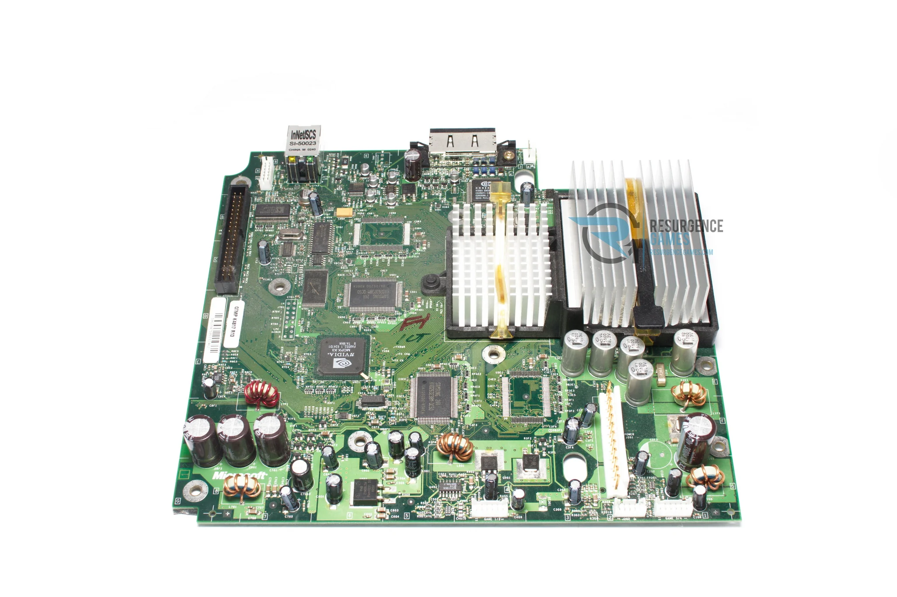
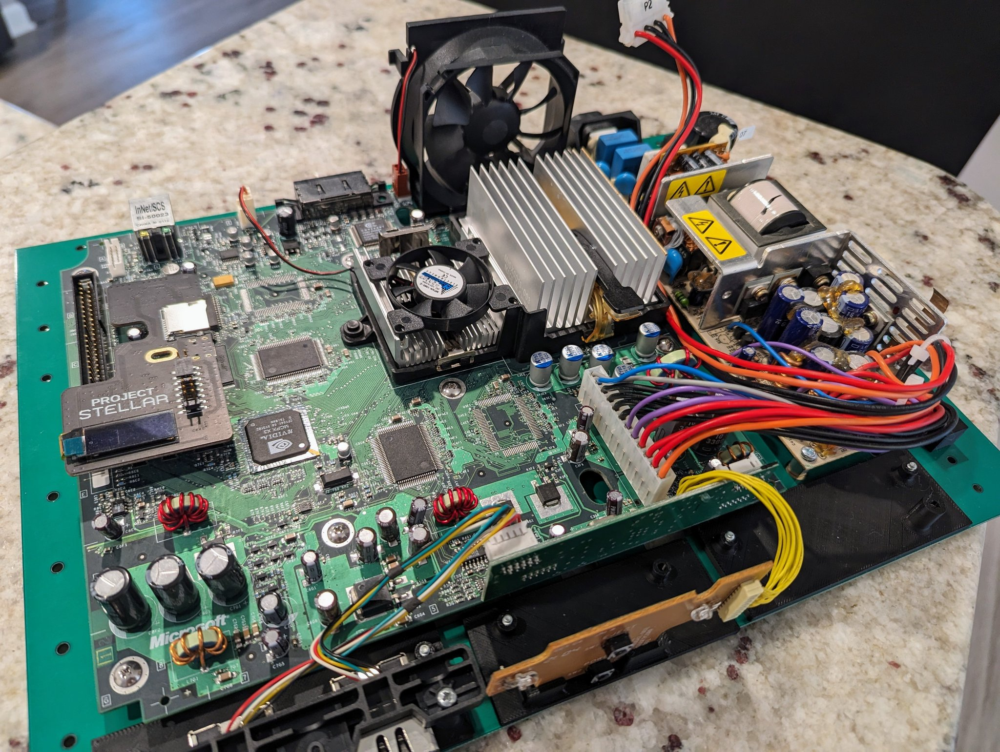
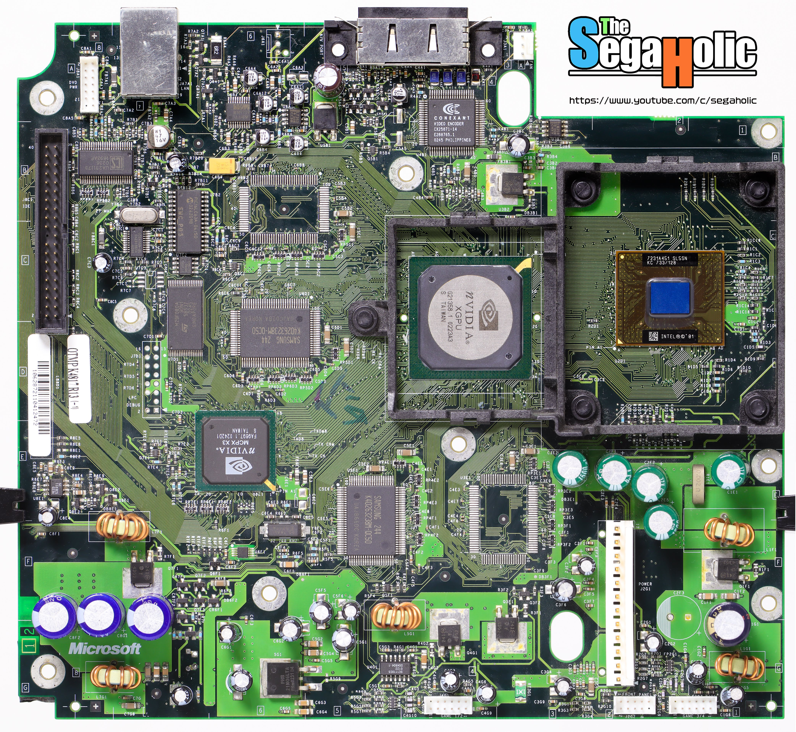
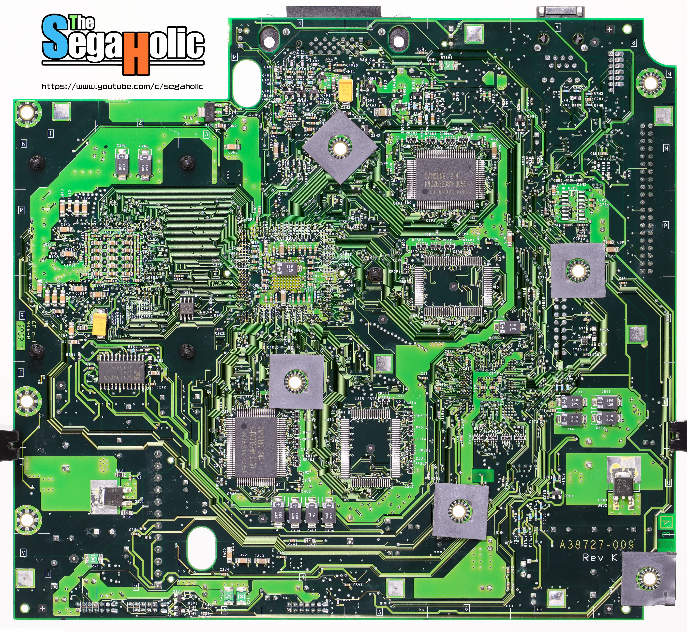

# v1.0 Motherboards

### v1.1 Console with Project Stellar Motherboard

# The Segaholic's Photos
[Twitter](twitter.com/The_SegaHolic) / [YouTube](https://www.youtube.com/channel/UCv66_uOZ4kjqrRQ8cTr2L_Q) / [Flickr](flickr.com/photos/ctwentytwo)

## Top

## Bottom

# Clean PCB images from sickmods.net
Exact source is unknown - Original website is down. (coming soon)

## Clean Top

## Clean Bottom

# Motherboard Capacitors
| Quantity | Voltage | Capacitance | Brand       | Size (mm) |
|----------|---------|-------------|-------------|-----------|
| 13x      | 25V     | 22uF        | Nippon SME  | 5x11      |
| 6x       | 25V     | 100uF       | Nichicon VR | 6x11      |
| 3x       | 16V     | 1500uF      | Nichicon PW | 12x20     |
| 2x       | 10V     | 3300uF      | Nichicon PW | 12.5x25   |
| 1x       | 10V     | 680uF       | Nichicon PW | 8x15      |
| 5x       | 6.3V    | 1500uF      | Nippon KZE  | 10x20     |
| 1x       | 2.5V    | 1F          | SuperStor   | N/A       |

## SMD Capacitors

| Quantity | Voltage | Capacitance | Brand       | Size (mm) |
|----------|---------|-------------|-------------|-----------|
| 1x       | 16V     | 47uF        | Nichicon WX | 6.3x5.4   |
| 6x       | 16V     | 10uF        | Nichicon WX | 3x5.4     |

## 240v PSU Caps: (Delta DPSN-96AP-1)

| Quantity | Voltage | Capacitance | Brand      | Size (mm)     |
|----------|---------|-------------|------------|---------------|
| 1x       | 50V     | 10uF        | LTEC ST    | 5x11          |
| 1x       | 25V     | 47uF        | LTEC LZG   | 5x11          |
| 2x       | 25V     | 100uF       | Nippon KY  | 6x11          |
| 2x       | 200V    | 330uF       | Taicon VZ  | 18x35         |
| 3x       | 10V     | 2200uF      | Nippon KY  | 10x30         |
| 1x       | 16V     | 1000uF      | Nippon KY  | 10x20         |
| 1x       | 250V    | 3.15A       | Bel (FUSE) | 8.35x7.7 (mm) |

