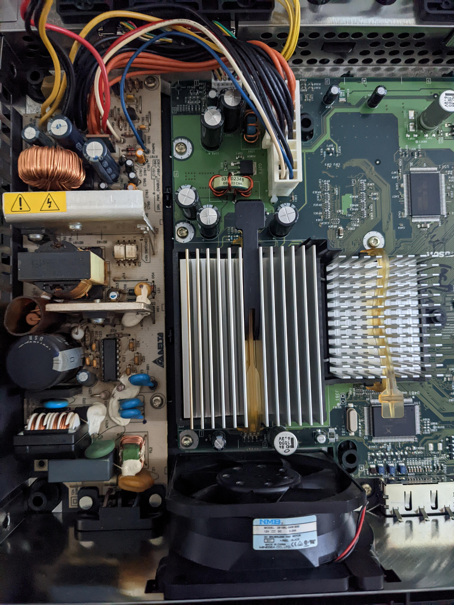
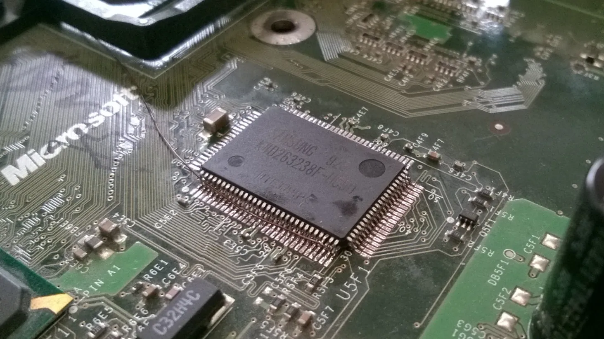
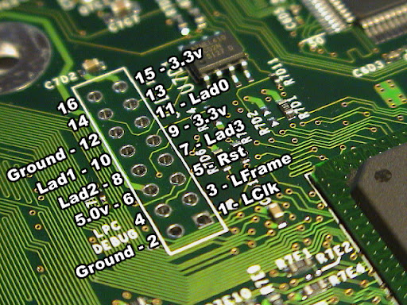
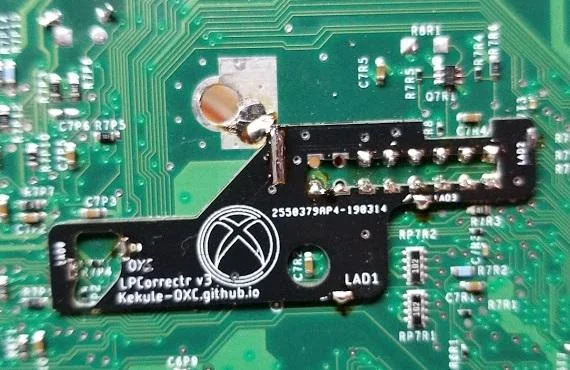
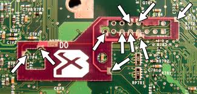

# Photos

## Xbox Original v1.6 Motherboard

## Clean Top

Source: [LoveMHz/xbox-board-re](https://github.com/LoveMHz/xbox-board-re) (Very high resolution)

## Clean Bottom

Source: [LoveMHz/xbox-board-re](https://github.com/LoveMHz/xbox-board-re) (Very high resolution)

# Capacitors

## Stacked 128MB Ram Upgrade
- [xbox-scene.info: 128MB Ram upgrade info](https://www.xbox-scene.info/tutorials/article/6-16-128mb-ram-upgrade-tutorial/)

## LPC Debug Port

## LPC Rebuild
- [YouTube:  Original Xbox 1.6 LPC Rebuild Board - Installation & Review from MrMario2011](https://www.youtube.com/watch?v=h2d44MyobX0)

## Clock Capacitor

- [consolemods.org: Clock Cap Info](https://consolemods.org/wiki/Xbox:Clock_Capacitor)

##

## Motherboard Capacitors
| Quantity | Type        | Voltage | Capacitance | Manufacturer |
|----------|-------------|---------|-------------|--------------|
| 11       | Nichicon VR | 25v     | 22uF        | Nichicon     |
| 3        | Nichicon VR | 25v     | 100uF       | Nichicon     |
| 3        | Rubycon ZL  | 6.3v    | 1500uF      | Rubycon      |
| 5        | Rubycon MBZ | 6.3v    | 3300uF      | Rubycon      |

## SMD Capacitors
| Quantity | Type | Voltage | Capacitance |
|----------|------|---------|-------------|
| 1        | SMD  | 16v     | 47uF        |
| 3        | SMD  | 16v     | 10uF        |

## Power Supply Unit
| Quantity | Voltage | Capacitance | Manufacturer |
|----------|---------|-------------|--------------|
| 3        | 50v     | 1uF         | CapXon       |
| 1        | 50v     | 0.47uF      | CapXon       |
| 1        | 50v     | 10uF        | CapXon       |
| 1        | 50v     | 22uF        | CapXon       |
| 1        | 10v     | 2200uF      | CapXon       |
| 1        | 25v     | 470uF       | CapXon       |
| 1        | 10v     | 3300uF      | CapXon       |
| 2        | 200v    | 330uF       | CapXon       |
