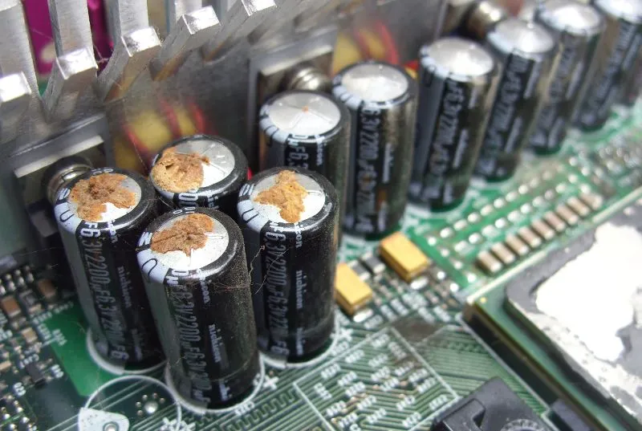

# A Statement to the Xbox Community About Xbox Capacitors

The original Xbox, a beloved console cherished by many, unfortunately fell victim to the infamous "capacitor plague."
This widespread issue plagued the gaming community between 1999 and 2007, primarily affecting non-solid aluminum electrolytic capacitors, particularly those from certain Taiwanese manufacturers.

The problem stemmed from a faulty electrolyte composition, leading to corrosion and gas generation within the capacitors.
This often resulted in the rupture of the capacitor's casing due to the pressure buildup, causing significant damage to the console and potentially rendering it inoperable.

Due to this, it is recommended to have your capacitors replaced.
It is possible to do it yourself, though we are not responsible for and damage caused by yourself.

- [Ask Hackaday: Experiences With Capacitor Failure](https://hackaday.com/2019/04/12/ask-hackaday-experiences-with-capacitor-failure/)

- [Wikipedia: Capacitor Plague](https://en.m.wikipedia.org/wiki/Capacitor_plague?wprov=sfla1)

- [Replacing Motherboard Capacitors How-To](https://capacitorlab.com/replacing-motherboard-capacitors-howto/)
- [How to Test a Capacitor With a Multimeter](https://tameson.co.uk/pages/capacitor-multimeter)

## Hardware by Motherboard Revision
- [Xbox v1.0 - v1.1](v1.0-1.1.md)
- [Xbox v1.2 - v1.5](v1.2-1.5.md)
- [Xbox v1.6](v1.6.md)

## Videos:
- [Great Video on Capacitor Life](https://www.youtube.com/watch?v=yGHV7xeKGcE)
- [What is a Capacitor and Common Uses](https://www.youtube.com/watch?v=L6cgSxpGmDo)
- [Thru-Hole Capacitor Replacement](https://www.youtube.com/watch?v=YCSNWi3UHf4)
- [Soldering Tip Care and General Soldering Tips](https://www.youtube.com/watch?v=_exJEnZN9QI&t=20s)
- [Drag Solder / RAM Upgrade](https://www.youtube.com/watch?v=Ee3SsR97EKA)

# Good / Bad Capacitor Brands

Understanding and knowing the bad/good capacitor brands:
- [BadCaps Forum Thread 1](https://www.badcaps.net/forum/showthread.php?t=388)
- [BadCaps Forum Thread 2](https://www.badcaps.net/forum/showthread.php?t=414)

Example of rating of capacitor at a sale site:
- **Manufacturer:** Panasonic
- **Product Category:** Capacitor Aluminum
- **Description:** Cap Aluminum Lytic 3300uF 6.3V 20% (10 X 20mm) Radial 5mm 2180mA 10,000h 105°C Bulk

# Source
This information was obtained by accessing old forum posts via way back machine.

[NeMesiS](https://www.ogxbox.com/forums/index.php?/profile/6795-nemesis/)
