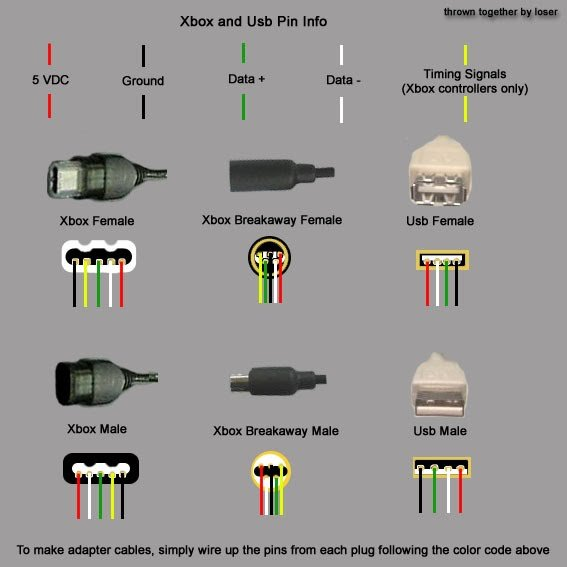
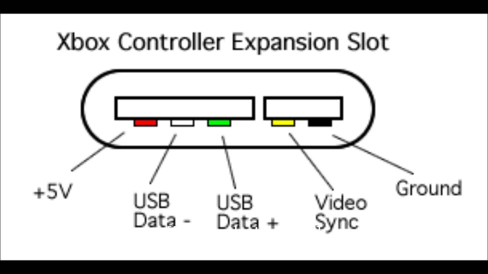
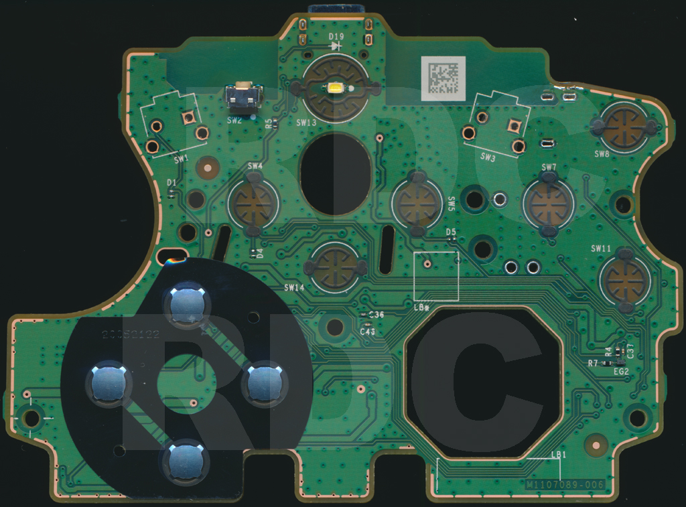
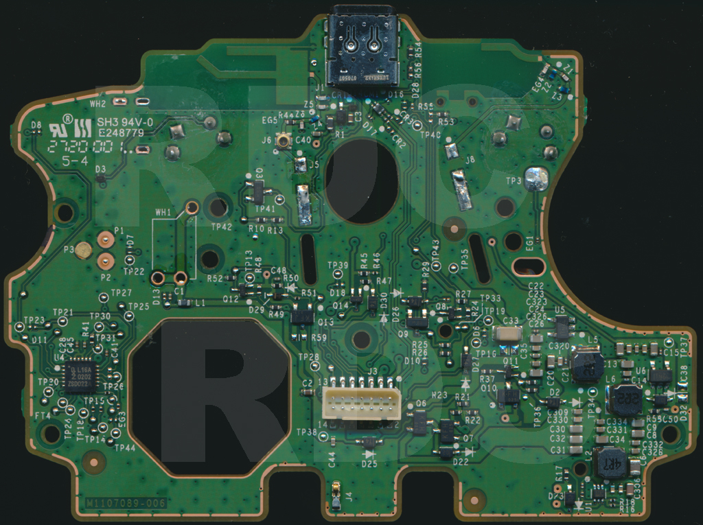
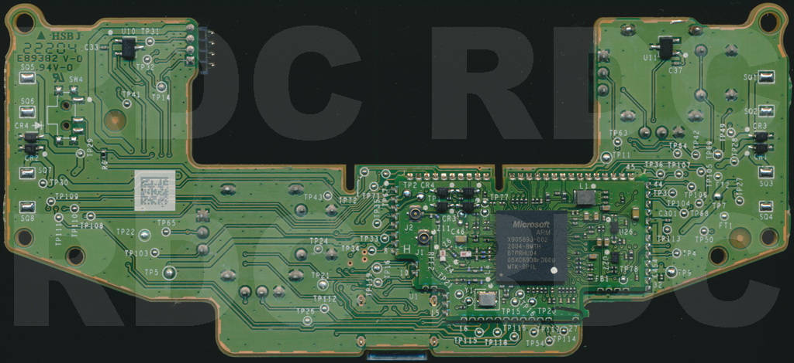
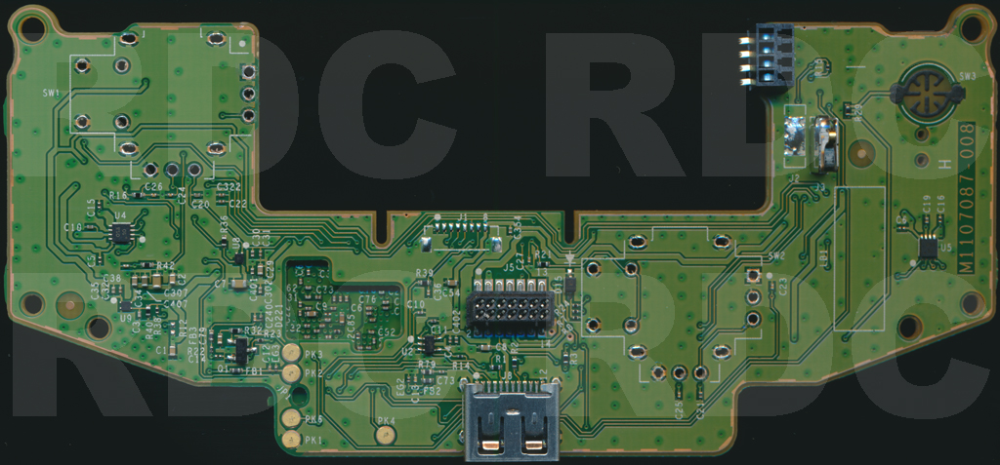
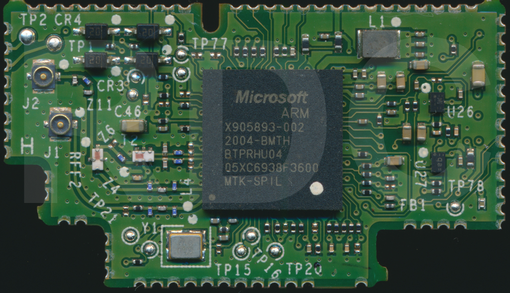
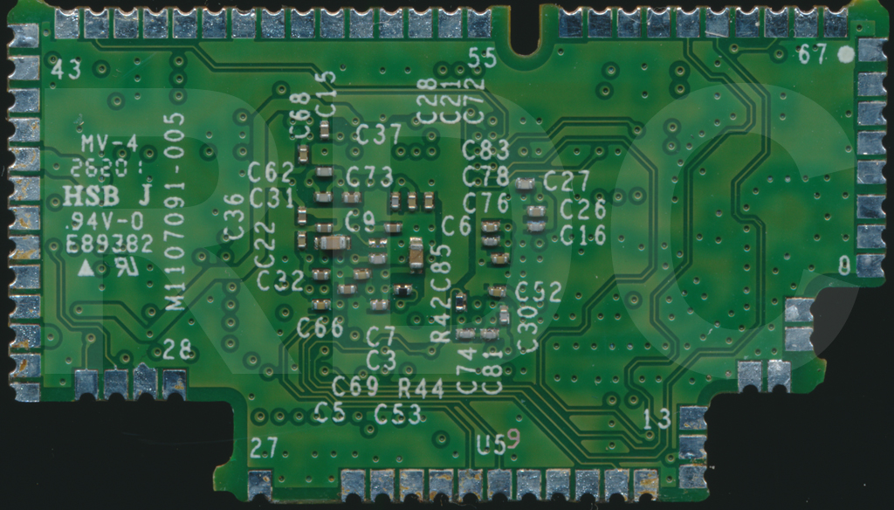
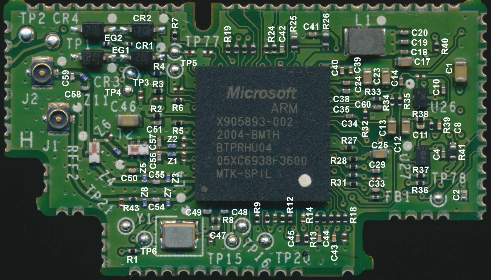
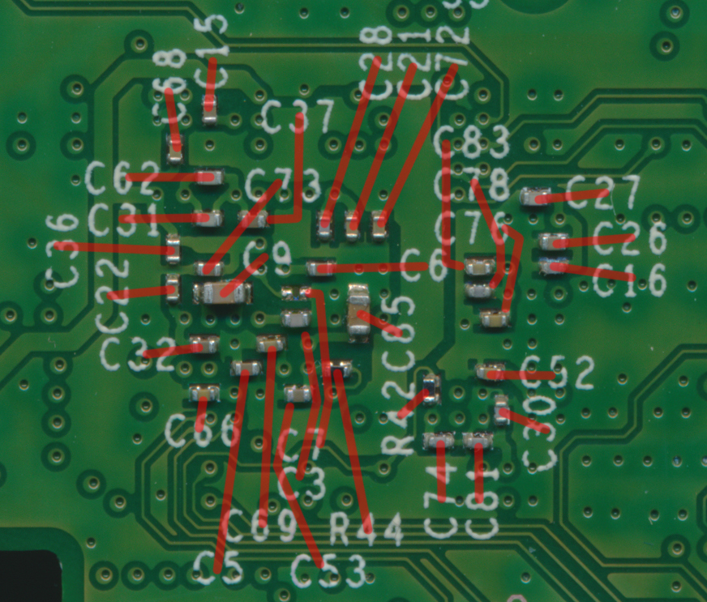

# Controllers

# Cable Pinout

# Expansion Slot Pinout

# Scans
Thanks to [RDC @ acidmods.com](https://acidmods.com/forum/index.php/topic,44711.0.html)

## 1914 Button / Power PCB

## 1914 MCU PCB Bottom

## 1914 SOC

## 1914 SOC Designators

## J3/J5 Connector Pinout

| Pin | Function    |
|-----|-------------|
| 1   | 3.6v        |
| 2   | GU (thru D27) Only Guide will work if J3/J5 pin 2 is used for new/alternate Guide button and the controller will not turn on. Use TP43 for a proper duplicate Guide button. |
| 3   | 3v/B+       |
| 4   | 3.3v        |
| 5   | SCL         |
| 6   | LED Control |
| 7   | SDA         |
| 8   | D+          |
| 9   | ~RESET      |
| 10  | D-          |
| 11  | -           |
| 12  | VBUS        |
| 13  | -           |
| 14  | GND         |

##  Button / Power PCB Test Points
Not all test points are listed

| Test Point | Function           |
|------------|--------------------|
| TP13       | 5v USB             |
| TP14       | DR                 |
| TP15       | DL                 |
| TP16       | DU                 |
| TP18       | SY                 |
| TP19       | LB                 |
| TP20       | RB                 |
| TP21       | A                  |
| TP22       | X                  |
| TP23       | Y                  |
| TP24       | MN                 |
| TP25       | VW                 |
| TP26       | U4p16              |
| TP27       | CC1 (thru R55*) CC2 (thru R56*) *not installed |
| TP28       | LED Control        |
| TP30       | SDA (U4)           |
| TP31       | SCL (U4)           |
| TP34       | 3v/B+              |
| TP35       | 3.3v               |
| TP36       | 3.6v (Rumble V+)   |
| TP37       | 3.6v               |
| TP38       | 5vA USB (after Q13)|
| TP39       | SH (Share)         |
| TP40       | LED (Anode, after R5) |
| TP41       | LED (Cathode)      |
| TP42       | LED Control (at Base/Gate of Q3) |
| TP43       | GU                 |
| TP44       | DD                 |

# MCU Test Points Board (some)

| Test Point | Function         |
|------------|------------------|
| FT1        | GND              |
| FT2        | GND              |
| TP5        | VBUS             |
| TP7        | 3.6v (Rumble V+)|
| TP9        | 3.3v             |
| TP21       | GND              |
| TP22       | GND              |
| TP24       | GND              |
| TP26       | GND              |
| TP27       | LT MOTOR+        |
| TP28       | HEAVY MOTOR+     |
| TP29       | RT MOTOR+        |
| TP30       | LIGHT MOTOR+     |
| TP31       | SDA2             |
| TP32       | SCL2             |
| TP33       | SDA              |
| TP34       | SCL              |
| TP35       | ~RESET           |
| TP36       | AN+ Enable       |
| TP41       | B (thru R29, 100ohm) |
| TP42       | LSC (thru R16, 33ohm) |
| TP43       | RSC (thru R21, 33ohm) |
| TP49       | TRG+ 3.2v, 125Hz, 17% Duty (Hall Sensor VCC) |
| TP50       | TRG+             |
| TP54       | MIC              |
| TP63       | LSY              |
| TP64       | LSX              |
| TP65       | RSY              |
| TP67       | RT               |
| TP68       | LT               |
| TP103      | AN+              |
| TP104      | HEAVY MOTOR & LT MOTOR CONTROL |
| TP105      | HEAVY MOTOR & LT MOTOR CONTROL |
| TP106      | HEAVY MOTOR & LT MOTOR CONTROL |
| TP107      | HEAVY MOTOR & LT MOTOR CONTROL |
| TP108      | LIGHT MOTOR & RT MOTOR CONTROL |
| TP109      | LIGHT MOTOR & RT MOTOR CONTROL |
| TP110      | LIGHT MOTOR & RT MOTOR CONTROL |
| TP111      | LIGHT MOTOR & RT MOTOR CONTROL |
| TP112      | RSX              |

# 1914 SOC PINOUT

| Pin | Function              |
|-----|-----------------------|
| 1   | J5p11, J7p1 (PnC related?) |
| 2   | USB D+                |
| 3   | USB D-                |
| 4   | ~RESET                |
| 5   | VBUS (thru R24 and divider R7/R8) |
| 6   | SDA                   |
| 7   | SCL                   |
| 8   | GND                   |
| 9   | J8p5 (thru R1)        |
| 10  | J5p13                 |
| 11  | GND                   |
| 12  | TP16                  |
| 13  | RSY                   |
| 14  | LED Control           |
| 15  | RSX                   |
| 16  | PK4, Headset Right Speaker (thru FB2) |
| 17  | U2p1                  |
| 18  | U5p3, Light Rumble    |
| 19  | J8p7                  |
| 20  | J8p11                 |
| 21  | B (thru R29)          |
| 22  | J8p8 (thru R2)        |
| 23  | SDA2                  |
| 24  | SCL2                  |
| 25  | J8p10                 |
| 26  | J8p4 (thru R3)        |
| 27  | U2p2                  |
| 28  | Q1p3, Headset         |
| 29  | GND                   |
| 30  | PK4, Headset (thru R79) |
| 31  | PK6, Headset Mic (thru R22, then FB3) |
| 32  | PK2, Headset Left Speaker (thru FB1) |
| 33  | GND                   |
| 34  | 3.3v                  |
| 35  | GND                   |
| 36  | TP4                   |
| 37  | TRG+ Enable (thru R38)|
| 38  | PK3, Headset          |
| 39  | GND                   |
| 40  | 3.3v                  |
| 41  | GND                   |
| 42  | GND (thru a trace, possibly -vRef?) |
| 43  | TP3                   |
| 44  | SW4 (not populated)  |
| 45  | GND                   |
| 46  | AN+ Enable            |
| 47  | U4p4, Heavy Rumble    |
| 48  | U4p3, Heavy Rumble    |
| 49  | U4p1, LT Rumble       |
| 50  | U4p2, LT Rumble       |
| 51  | GND                   |
| 52  | 3.3v                  |
| 53  | 1.8v                  |
| 54  | LT (thru R42)         |
| 55  | LSY                   |
| 56  | GU                    |
| 57  | LSX                   |
| 58  | LSC (thru R16)        |
| 59  | U5p1, RT Rumble       |
| 60  | J1p6                  |
| 61  | U5p2, RT Rumble       |
| 62  | U5p4, Light Rumble    |
| 63  | J1p4                  |
| 64  | J1p3                  |
| 65  | J1p5                  |
| 66  | J1p7                  |
| 67  | RT (thru R39)         |
| 68  | GND                   |
| 69  | RSC (thru R21)        |
