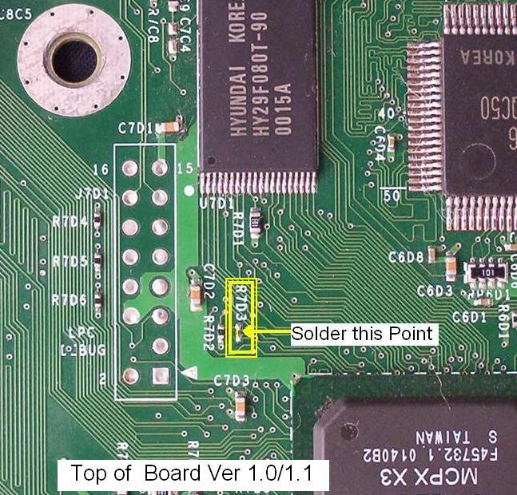
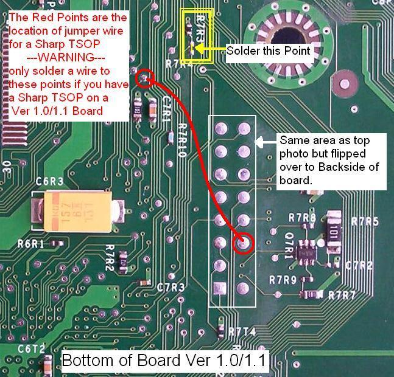
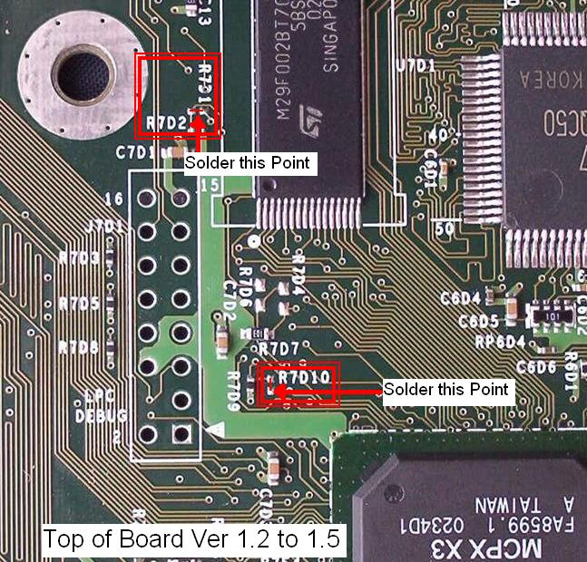

# TSOP Flashing Unlock Guide
A TSOP (Thin Small Outline Package) mod for the original Xbox involves flashing the Xbox's onboard flash memory chip with custom firmware. This modification allows users to run unsigned code, such as custom operating systems or homebrew software, on their Xbox consoles. TSOP flashing is considered a relatively advanced modding technique and requires soldering skills as well as careful attention to detail to avoid damaging the console. Once successfully completed, however, it opens up a wide range of possibilities for customizing and enhancing the functionality of the original Xbox.

## 1.0/1.1 Xbox Motherboard

Connect the two solder pads at R7D3 as in photo above.

Connect the two solder pads at R7R3 as in photo above.

All Ver 1.0/1.1 Xbox's with a 'SHARP' TSOP chip must also connect the additional red wire as in the photo above. All other TSOP's DO NOT require this step.

## TSOP Unlock points for all Versions 1.2/1.3/1.4/1.5/ Xbox's

These Xbox's have both points located on the top of the motherboard, for the first point connect the two solder pads at R7D10 as in photo above. For the second point locate the junction between R7D2 and R7D1 and connect the two solder pads as in the photo above.

After the solder points are completed you should re-assemble your xbox (but leave the top cover off) when the power button is pressed it should boot normally as it did before you started.

Note if you get the message TSOP write protected while attempting to Flash the TSOP you might need to check and resolder the points to ensure a good connection was while attempting to Flash the TSOP you might need to check and resolder the points to ensure a good connection was made.

Sources:

- [http://www.biline.ca/xbox_solder.htm](http://www.biline.ca/xbox_solder.htm)
